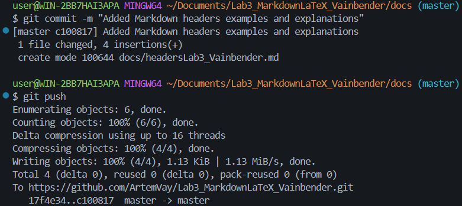

# Лабораторная работа №3. Работа с Markdown-разметкой и базовое использование LaTeX в документации проекта

_Markdown — это лёгкий язык разметки. LaTeX — мощная система вёрстки_

### Структура проекта:

- Lab3_MarkdownLaTeX_Vainbender
  - docs
  - img
  - latex
    - README.md

# Markdown-элементы

# Заголовок H1 **жирный**

---

## Заголовок H2 _курсив_

---

### Заголовок H3 ~~зачёркнутый~~

---

- 23
- 51

1. 32
2. 41

3. 23 1. 23 \* 13
   > Цитата

```py
print(25)
```

| 1   |  2  |   3 |
| :-- | :-: | --: |
| 11  | 22  |  33 |
| 111 | 222 | 333 |



[Markdown](https://markdown.org/ "Перейти на Markdown")
[Markdown](https://markdown.org/ "Перейти на Markdown")

- [ ] Task 1
- [x] Task 2

В стиле GitHub[^1].
[^1]: GitHub - это GitHub.

> [!NOTE]
> примечание

> [!TIP]
> тип

> [!WARNING]
> предупреждение

Площадь круга: $S = \pi r^2$
$$
\sum_{i=1}^n i = \frac{n(n+1)}{2}
$$
